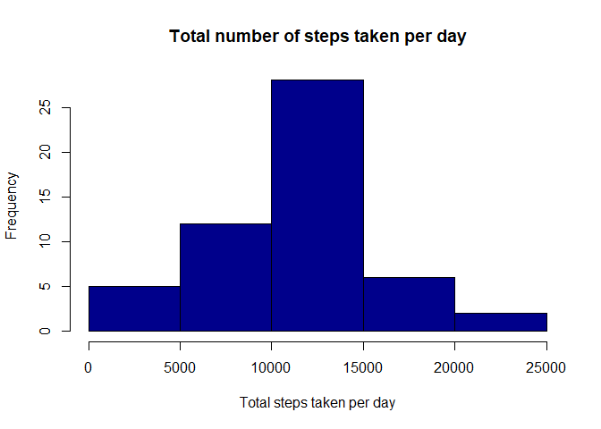
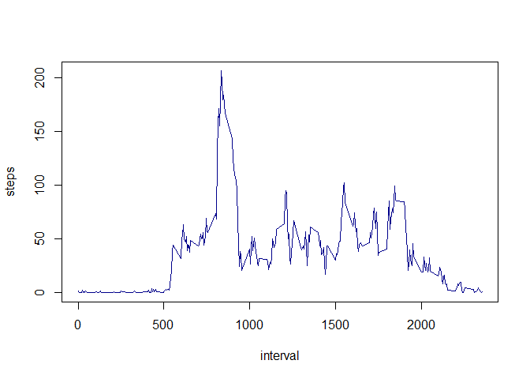
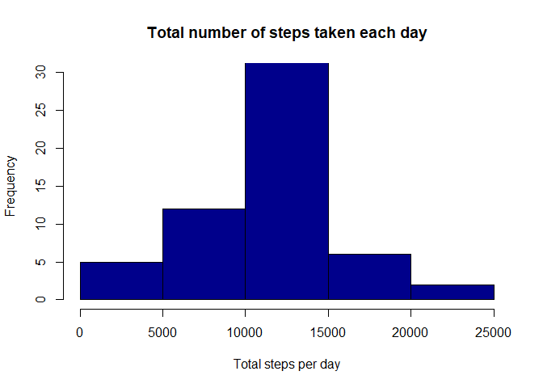
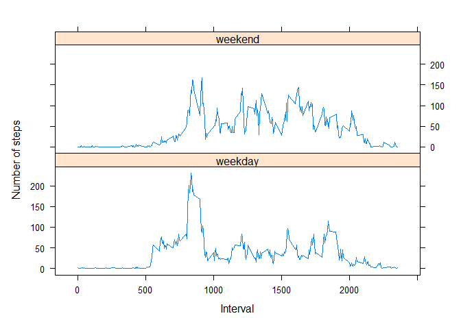

---
output:
  html_document: 
    keep_md: yes
  pdf_document: default
---
Investigación reproducible: Tareas calificadas por los compañeros Course Project 1

Cargar los datos 


```r
activity_data <- read.csv("./data/activity.csv")
```

preprocesar los datos


```r
names(activity_data)
```

```
## [1] "steps"    "date"     "interval"
```


```r
head(activity_data)
```

```
##   steps       date interval
## 1    NA 2012-10-01        0
## 2    NA 2012-10-01        5
## 3    NA 2012-10-01       10
## 4    NA 2012-10-01       15
## 5    NA 2012-10-01       20
## 6    NA 2012-10-01       25
```


```r
summary(activity_data)
```

```
##      steps            date              interval     
##  Min.   :  0.00   Length:17568       Min.   :   0.0  
##  1st Qu.:  0.00   Class :character   1st Qu.: 588.8  
##  Median :  0.00   Mode  :character   Median :1177.5  
##  Mean   : 37.38                      Mean   :1177.5  
##  3rd Qu.: 12.00                      3rd Qu.:1766.2  
##  Max.   :806.00                      Max.   :2355.0  
##  NA's   :2304
```

¿Cuál es la media del número total de pasos dados por día?

1. Calcular el número total de pasos dados por día

```r
steps_day <- aggregate(steps ~ date, activity_data, sum, na.rm=TRUE)
steps_day
```

```
##          date steps
## 1  2012-10-02   126
## 2  2012-10-03 11352
## 3  2012-10-04 12116
## 4  2012-10-05 13294
## 5  2012-10-06 15420
## 6  2012-10-07 11015
## 7  2012-10-09 12811
## 8  2012-10-10  9900
## 9  2012-10-11 10304
## 10 2012-10-12 17382
## 11 2012-10-13 12426
## 12 2012-10-14 15098
## 13 2012-10-15 10139
## 14 2012-10-16 15084
## 15 2012-10-17 13452
## 16 2012-10-18 10056
## 17 2012-10-19 11829
## 18 2012-10-20 10395
## 19 2012-10-21  8821
## 20 2012-10-22 13460
## 21 2012-10-23  8918
## 22 2012-10-24  8355
## 23 2012-10-25  2492
## 24 2012-10-26  6778
## 25 2012-10-27 10119
## 26 2012-10-28 11458
## 27 2012-10-29  5018
## 28 2012-10-30  9819
## 29 2012-10-31 15414
## 30 2012-11-02 10600
## 31 2012-11-03 10571
## 32 2012-11-05 10439
## 33 2012-11-06  8334
## 34 2012-11-07 12883
## 35 2012-11-08  3219
## 36 2012-11-11 12608
## 37 2012-11-12 10765
## 38 2012-11-13  7336
## 39 2012-11-15    41
## 40 2012-11-16  5441
## 41 2012-11-17 14339
## 42 2012-11-18 15110
## 43 2012-11-19  8841
## 44 2012-11-20  4472
## 45 2012-11-21 12787
## 46 2012-11-22 20427
## 47 2012-11-23 21194
## 48 2012-11-24 14478
## 49 2012-11-25 11834
## 50 2012-11-26 11162
## 51 2012-11-27 13646
## 52 2012-11-28 10183
## 53 2012-11-29  7047
```

2. histograma del número total de pasos dados cada día


```r
hist(steps_day$steps, main = "Total number of steps taken per day", xlab = "Total steps taken per day", col = "darkblue")
```

<!-- -->

3. Calcule e informe la media y la mediana del número total de pasos dados por día


```r
mean_steps_day <- mean(steps_day$steps)
mean_steps_day
```

```
## [1] 10766.19
```


```r
median_steps_day <- median(steps_day$steps)
median_steps_day
```

```
## [1] 10765
```

¿Cuál es el patrón de actividad diaria promedio?

1. Gráfica de serie de tiempo del intervalo de 5 minutos 


```r
steps_interval<-aggregate(steps~interval, data=activity_data, mean, na.rm=TRUE)
plot(steps~interval, data=steps_interval, type="l", col="darkblue")
```

<!-- -->

2. ¿Qué intervalo de 5 minutos, en promedio de todos los días del conjunto de datos, contiene la cantidad máxima de pasos?


```r
interval_Max_steps <- steps_interval[which.max(steps_interval$steps),]$interval
interval_Max_steps
```

```
## [1] 835
```

Imputación de valores faltantes

1. Número total de valores faltantes en el conjunto de datos 


```r
values_missings <- sum(is.na(activity_data$steps))
values_missings
```

```
## [1] 2304
```

2. Estrategia para completar todos los valores que faltan en el conjunto de datos. 


```r
mean_steps_interval<-function(interval){
    steps_interval[steps_interval$interval==interval,]$steps
}
```

3. Nuevo conjunto de datos igual al conjunto de datos original con los datos faltantes completados.


```r
activity_data_NA<-activity_data
for(i in 1:nrow(activity_data_NA)){
    if(is.na(activity_data_NA[i,]$steps)){
        activity_data_NA[i,]$steps <- mean_steps_interval(activity_data_NA[i,]$interval)
    }
}
```

Histograma del número total de pasos dados por día, calculo de la  media  y  la mediana. 
¿Estos valores difieren de las estimaciones de la primera parte de la tarea? 
 ¿Cuál es el impacto de imputar los datos que faltan en las estimaciones del número total diario de pasos?


```r
steps_day_NA <- aggregate(steps ~ date, data=activity_data_NA, sum)
hist(steps_day_NA $steps, col = "darkblue", xlab = "Total steps per day", ylim = c(0,30), main = "Total number of steps taken each day")
```

<!-- -->

```r
mean_steps_day_NA <- mean(steps_day_NA$steps)
median_steps_day_NA <- median(steps_day_NA$steps)
```

La media no cambió después de los reemplazos de NA, la mediana cambió en un porcentaje del 0,1%.

¿Hay diferencias en los patrones de actividad entre los días de semana y los fines de semana?


```r
activity_data_NA$date <- as.Date(strptime(activity_data_NA$date, format="%Y-%m-%d"))
activity_data_NA$day <- weekdays(activity_data_NA$date)
for (i in 1:nrow(activity_data_NA)) {
    if (activity_data_NA[i,]$day %in% c("Saturday","Sunday")) {
        activity_data_NA[i,]$day<-"weekend"
    }
    else{
        activity_data_NA[i,]$day<-"weekday"
    }
}
steps_day <- aggregate(activity_data_NA$steps ~ activity_data_NA$interval + activity_data_NA$day, activity_data_NA, mean)
```

Gráfico de series de tiempo del intervalo de 5 minutos


```r
names(steps_day) <- c("interval", "day", "steps")
library(lattice)
xyplot(steps ~ interval | day, steps_day, type = "l", layout = c(1, 2), 
    xlab = "Interval", ylab = "Number of steps")
```

<!-- -->

